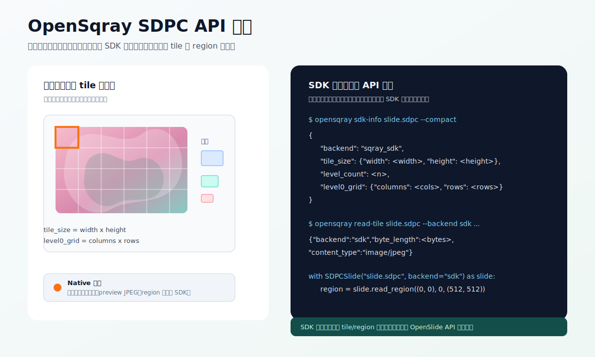
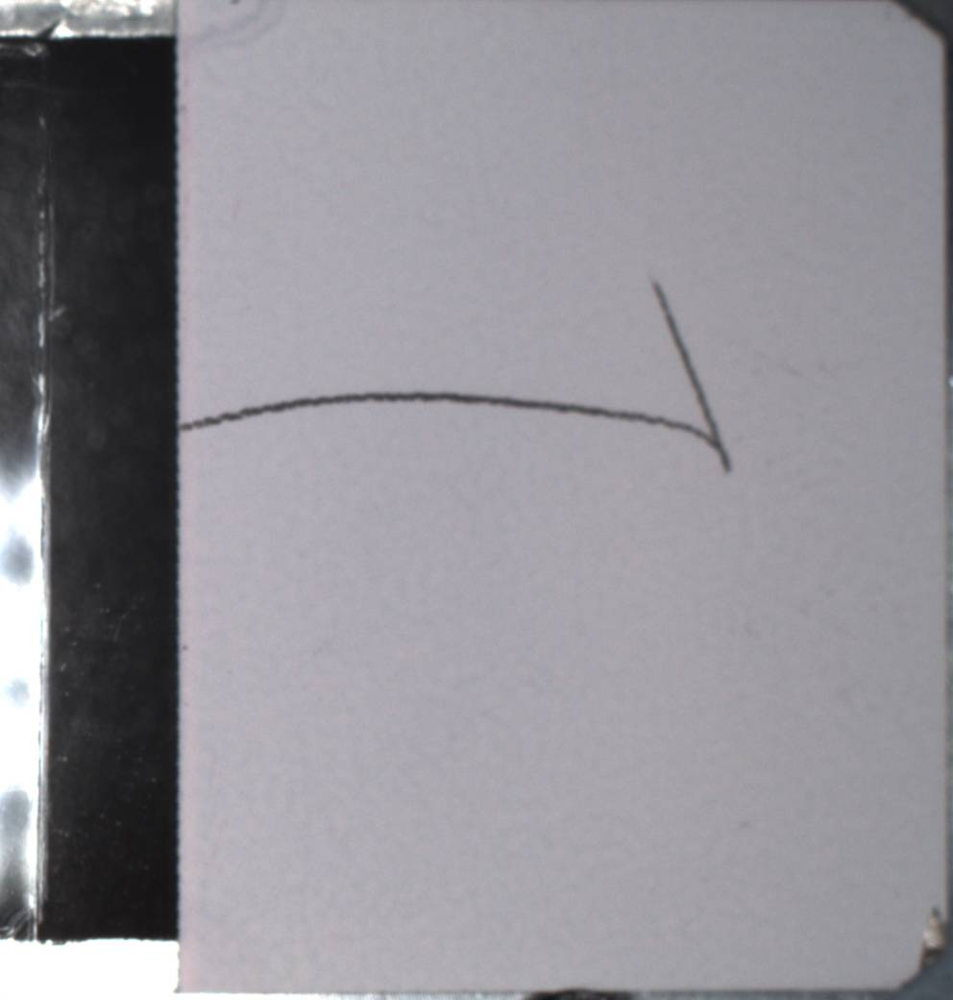
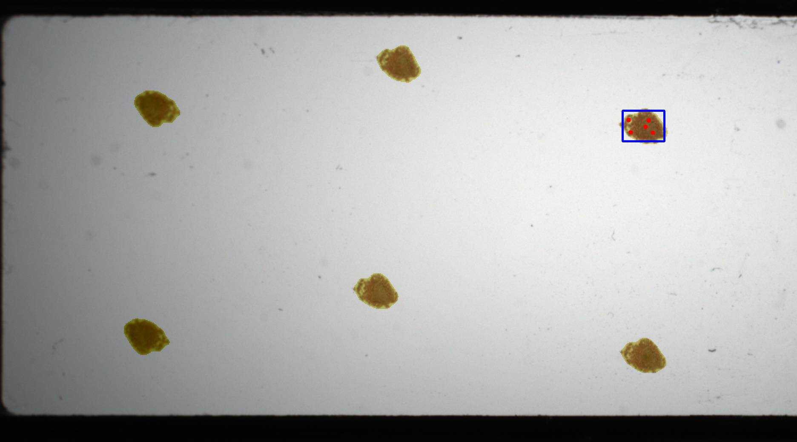
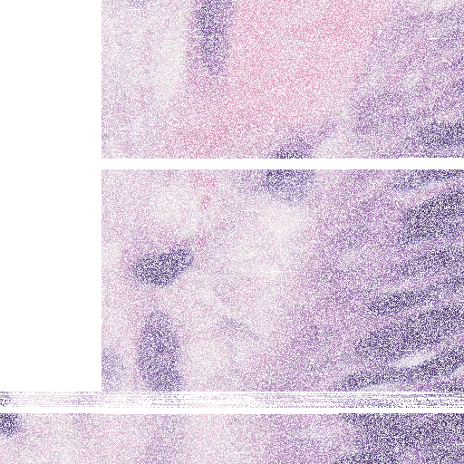

# OpenSqray

[](https://github.com/SuooL/opensqray/actions/workflows/ci.yml)


**语言 / Language**: 简体中文 | [English](README.en.md)

**教程**: [Jupyter Tutorial](examples/opensqray_tutorial.ipynb)

OpenSqray 是一个面向全切片病理图像（Whole Slide Image, WSI）的 Python 工具库，当前重点支持 Sqray SDPC 文件的公开安全解析、元数据检查、候选 JPEG 资源提取，以及 SDK-backed OpenSlide-like 读图能力。对 SVS 等通用 WSI 格式，OpenSqray 通过可选 OpenSlide 依赖进行检查，不重复造一套私有解析器。

项目目标不是把未公开格式“猜成确定协议”，而是提供一个可测试、可复现、边界清楚的工程层：能原生解析的内容原生解析；需要官方运行时才能可靠完成的像素读取，明确交给可选 SDK 后端。

## 功能概览

- SDPC 基础元数据解析：尺寸、层级数、tile size、缩略图尺寸、扫描倍率、设备/扫描相关字符串等。
- 嵌入 JPEG 记录扫描：过滤明显 false positive，只返回可解析的 JPEG 记录。
- Associated image 候选：可列出和导出 label/macro 等候选 JPEG 资源。
- Tile index 研究工具：提供 row-major 候选 tile 映射和 index-table 诊断输出。
- `OpenSqraySlide`：SDK-backed OpenSlide-like 兼容类，支持 SDPC 上的 `read_region()`、`get_thumbnail()`、`associated_images`、level metadata 和 properties。
- 批量 patch 读取：`RegionRequest`、`iter_patch_requests()` 和 `read_regions()` 支持显式 worker 并行，每个 worker 使用独立 SDK slide handle。
- 研究型 `SDPCSlide` facade：提供 metadata、candidate JPEG byte、SDK tile/region 低层接口。
- 可选 Pillow 解码：安装 `opensqray[image]` 后可将候选 JPEG 或 SDK BGRA region 转成图像对象。
- 可选 Sqray SDK 后端：在用户本地具备合法 SDK runtime 时，提供更可靠的 SDPC tile JPEG 与 region 读取。
- 可选 OpenSlide 后端：用于 SVS 等 OpenSlide 支持的标准格式检查。

## 效果预览



上图是公开安全的合成流程示意图，展示 OpenSqray 的典型调用路径：原生解析用于元数据与候选资源研究，SDK 后端用于坐标准确的 tile/region 读取。

下面是真实公开 SDPC 样本 `20220514_145829_0.sdpc` 的 associated-image 导出效果，由 `opensqray extract-associated` 直接生成。候选名称仍是启发式命名，不代表已确认的官方 SDPC directory entry。

| `label_candidate` | `macro_candidate` |
| --- | --- |
|  |  |

下面是真实 SDK-backed `OpenSqraySlide.read_region((14000, 3600), 0, (512, 512))` 输出，说明 SDPC 已经可以走类 OpenSlide 的 region 读取路径：



想看可复现的真实文件执行过程，可以打开 [examples/opensqray_tutorial.ipynb](examples/opensqray_tutorial.ipynb)。该 notebook 默认读取本地 `data/20220514_145829_0.sdpc`，也可以通过 `OPENSQRAY_TUTORIAL_SDPC=/path/to/file.sdpc` 指向其他 SDPC 文件，并实际运行 OpenSqray parser、`SDPCSlide` 和 CLI。公开仓库不分发 `data/` 中的真实切片文件；如果你从 GitHub 克隆项目，需要在本地提供自己的 SDPC 文件后再运行 notebook。

## 安装

从源码安装：

```bash
git clone https://github.com/SuooL/opensqray.git
cd opensqray
python3 -m venv .venv
. .venv/bin/activate
python -m pip install -e .
```

安装图像解码能力：

```bash
python -m pip install -e ".[image]"
```

安装 OpenSlide Python 绑定：

```bash
python -m pip install -e ".[openslide]"
```

使用 SVS 等 OpenSlide-backed 格式时，还需要系统中已安装 OpenSlide native library。

配置可选 Sqray SDK 后端：

```bash
export OPENSQRAY_SDK_LIB_DIR=/path/to/sqrayslide/lib
# 或者：
export OPENSQRAY_SDK_DIR=/path/to/sqrayslide
```

如果 SDK runtime 还依赖额外 native library 目录：

```bash
export OPENSQRAY_SDK_EXTRA_LIB_DIRS=/path/to/extra/libs
```

macOS 上，当前 Sqray SDK 包的动态库 `rpath` 需要在启动 Python 前配置：

```bash
export OPENSQRAY_SDK_LIB_DIR=/path/to/sqrayslide/lib
export DYLD_LIBRARY_PATH="$OPENSQRAY_SDK_LIB_DIR:/path/to/libomp/lib:${DYLD_LIBRARY_PATH:-}"
```

OpenSqray 不随仓库分发、复制或再打包任何专有 SDK 二进制文件。

私有部署时的 SDK runtime wheel / native library 打包建议见 [SDK Runtime and Packaging Strategy](docs/sdk-runtime-packaging.md)。每个平台的实际验证流程见 [SDK Runtime Validation](docs/sdk-runtime-validation.md)。大规模 patch 处理建议见 [High-Throughput Patch Extraction Plan](docs/performance-plan.md)。

## 快速开始

检查 SDPC 元数据：

```bash
opensqray inspect path/to/slide.sdpc --compact
```

列出 associated image 候选：

```bash
opensqray associated path/to/slide.sdpc --compact
```

导出 associated image 候选 JPEG：

```bash
opensqray extract-associated path/to/slide.sdpc \
  --output-dir associated-images
```

查看 tile-grid 候选：

```bash
opensqray tile-index path/to/slide.sdpc \
  --preview-limit 30 \
  --compact
```

读取一个候选 tile JPEG：

```bash
opensqray read-tile path/to/slide.sdpc \
  --backend native \
  --preview-limit 100 \
  --level 0 --tile-x 0 --tile-y 0 \
  --output tile-native.jpg
```

使用 SDK 后端读取 tile：

```bash
opensqray read-tile path/to/slide.sdpc \
  --backend sdk \
  --sdk-lib-dir /path/to/sqrayslide/lib \
  --level 0 --tile-x 0 --tile-y 0 \
  --output tile-sdk.jpg
```

验证 SDK runtime 的实际可用性：

```bash
python3 tools/validate_sdk_runtime.py path/to/slide.sdpc \
  --sdk-lib-dir /path/to/sqrayslide/lib \
  --workers 4 \
  --patch-size 256 \
  --patch-count 16
```

该验证会检查 metadata、associated images、thumbnail、tile JPEG、多个 region、重复读取 hash 一致性、串行/并行 batch 一致性和 patch throughput；不是只做 smoke test。

检查 SVS 等 OpenSlide 支持的文件：

```bash
opensqray inspect path/to/slide.svs --compact
```

如果 OpenSlide 不可用，CLI 会返回清晰的依赖提示，而不是尝试用 SDPC parser 解析 SVS。

## Python API

实际读图推荐使用 SDK-backed `OpenSqraySlide`，它面向 OpenSlide 常见使用方式：

```python
from opensqray import OpenSqraySlide

with OpenSqraySlide("path/to/slide.sdpc") as slide:
    print(slide.dimensions)
    print(slide.level_count)
    print(slide.level_dimensions)
    print(slide.level_downsamples)
    print(slide.properties["openslide.mpp-x"])

    region = slide.read_region((0, 0), 0, (512, 512))
    thumbnail = slide.get_thumbnail((512, 512))
    label = slide.associated_images["label"]

    region.save("region.png")
    thumbnail.save("thumbnail.jpg")
```

如果你希望同一个入口同时处理 SDPC 和 OpenSlide 支持的 SVS，可以使用 `open_slide()`：

```python
from opensqray import open_slide

with open_slide("path/to/slide.sdpc") as slide:
    region = slide.read_region((0, 0), 0, (512, 512))
```

批量读取 patch：

```python
from opensqray import OpenSqraySlide, iter_patch_requests

with OpenSqraySlide("path/to/slide.sdpc") as slide:
    requests = iter_patch_requests(
        slide.dimensions,
        patch_size=(512, 512),
        stride=(512, 512),
        level=0,
    )
    patches = slide.read_regions(requests, workers=4)
```

`read_regions()` 的并行路径会为每个 worker 打开独立 SDK handle，避免在 vendor SDK 线程安全语义尚未公开时共享同一个 handle。处理上万张切片时，建议外层按 slide 做进程级并行，内层每张 slide 使用少量 workers。

原生 SDPC 元数据与候选 JPEG：

```python
from opensqray import SDPCSlide

with SDPCSlide("path/to/slide.sdpc") as slide:
    print(slide.dimensions)
    print(slide.level_dimensions)
    print(slide.level_downsamples)
    print(slide.properties["opensqray.backend"])

    tile_jpeg = slide.read_tile_jpeg_bytes(level=0, tile_x=0, tile_y=0)
```

解码候选 JPEG 需要安装 `opensqray[image]`：

```python
from opensqray import SDPCSlide

with SDPCSlide("path/to/slide.sdpc") as slide:
    tile_image = slide.read_tile_image(level=0, tile_x=0, tile_y=0)
```

SDK 后端 region 读取：

```python
from opensqray import SDPCSlide

with SDPCSlide("path/to/slide.sdpc", backend="sdk") as slide:
    tile_jpeg = slide.read_tile_jpeg_bytes(level=0, tile_x=0, tile_y=0)
    region_bgra = slide.read_region_bgra_bytes((0, 0), 0, (512, 512))
    region_image = slide.read_region((0, 0), 0, (512, 512))
```

`read_region()` 会把 SDK 返回的 BGRA bytes 转成 Pillow RGBA image，因此需要安装 `opensqray[image]`。

## 后端能力边界

OpenSqray 当前有两个 SDPC 路径：

- `backend="native"`：公开 parser 路径，不依赖专有 runtime，适合元数据、associated image 候选、tile/index 研究和 preview-limited tile JPEG byte 读取。
- `OpenSqraySlide` / `backend="sdk"`：官方 runtime adapter，是当前实际可用的 SDPC 读图路径，适合需要坐标准确 tile JPEG、region read、thumbnail 和 associated image 的场景。

| 能力 | Native 后端 | SDK 后端 |
| --- | --- | --- |
| SDPC 元数据 / properties | 支持 | 支持，并提供 OpenSlide-style properties |
| level dimensions / downsamples | 基于已解析信息推断 | 支持，`OpenSqraySlide` 输出 OpenSlide-style downsamples |
| associated images | 启发式 JPEG 候选 | 支持 `label` / `thumbnail` / `macro` |
| 按坐标读取 tile JPEG | 启发式、受 preview 限制 | 支持 |
| `read_region_bgra_bytes()` | 尚未实现 | 支持 |
| `read_region()` | 抛出 `NotImplementedError` | 安装 Pillow 后支持 |
| `get_thumbnail()` | 尚未实现 | 支持 |
| `get_best_level_for_downsample()` | 尚未实现 | 支持 OpenSlide-style downsample 选择 |
| 批量 patch 读取 | 尚未实现 | 支持 `read_regions()` / `iter_patch_requests()` |
| color correction / ICC | 尚未实现 | SDK 有接口，尚未暴露为 OpenSlide ICC 语义 |
| fluorescence / channels / focal planes | 尚未实现 | 尚未封装 |
| 完整 OpenSlide API 兼容 | 尚未达到 | 核心读图 API 可用；error-latching、DeepZoom helper、ICC 等仍在路线图 |

结论很直接：如果要在 SDPC 上像 OpenSlide 处理 SVS 一样做实际读图，请使用 `OpenSqraySlide` 并配置官方 Sqray SDK runtime。纯 native 后端目前不是生产读图路径，它只适合公开安全 metadata / 格式研究。

## 输出契约

SDPC inspection 输出版本化 JSON，当前 schema 为：

```text
opensqray.sdpc.metadata.v1
```

稳定字段与研究诊断字段会分开输出，避免下游把 reverse-engineering 证据误当作已确认格式协议。`index-research` 也使用独立 schema：

```text
opensqray.sdpc.index_research.v4
```

这些诊断结果用于格式研究，不应直接视为完整 SDPC tile directory。

## 路线图

- [x] 项目骨架、CLI、synthetic fixture 测试。
- [x] SDPC metadata parser 与版本化 JSON 输出。
- [x] associated image 候选发现与导出。
- [x] tile-grid 候选、length-table reconstruction 与 index-research v4 诊断。
- [x] `SDPCSlide` facade、Pillow 解码适配、SDK backend MVP。
- [x] SDK-backed `OpenSqraySlide` compatibility layer：`read_region()`、`get_thumbnail()`、associated images、level metadata。
- [x] SDK-backed 批量 patch 读取 helper 与并行 worker 模型。
- [x] 私有 SDK runtime 打包策略、大规模 patch 性能计划与实际 runtime validator。
- [x] macOS Apple Silicon 与 Linux x86_64 真实 SDK + 公开 SDPC 样本验证。
- [ ] Windows x86_64、Linux arm64、macOS Intel 的真实 runtime 验证。
- [ ] confirmed native tile map 与 native `read_region()`，前提是 SDPC tile directory 证据足够。
- [ ] OpenSlide error-latching、DeepZoom helper、ICC/color correction 等 parity 扩展。
- [ ] 私有平台 runtime wheel / native shim 的内部构建与验证流水线。

完整路线图见 [OpenSqray Roadmap](docs/roadmap.md)。当前最优先的剩余工作不是继续扩大公开 parser 的猜测范围，而是补齐跨平台 SDK runtime 验证与私有 runtime 打包；native SDPC region assembly 会继续作为研究线推进，直到 tile directory 证据足够自洽。

## 开发

运行测试：

```bash
python3 -m unittest discover -s tests
```

测试使用 synthetic fixtures，不依赖真实切片数据或专有 SDK。

## 安全与数据边界

OpenSqray 仓库保存公开源码、测试 fixture、文档，以及从公开 SDPC 样本导出的轻量预览图；不包含完整真实切片样本、可识别患者数据、专有 SDK 二进制文件或非公开实现。需要 SDK 后端时，请在自己的运行环境中配置合法 SDK runtime。

## 致谢

OpenSqray 的 SDPC 研究与工程设计参考了 [OpenSDPC](https://github.com/WonderLandxD/opensdpc) 的公开工作。OpenSqray 不复制或再分发其代码；相关格式理解会保持来源边界和实现边界清晰。

## 许可证

当前尚未选择开源许可证。仓库公开可见不代表授予使用、复制、分发或修改权利；正式复用前请等待仓库所有者补充许可证。
